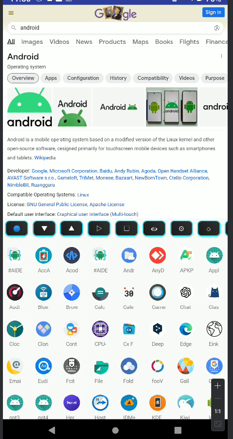

# slauncher
a simple android launcher with webview, it's a launcher and browser : )

almost code is generated by chatgpt, I have few experience on android dev 





# guide generated by gpt4-turbo


Welcome , your personalized Android launcher that brings a unique web browsing and app management experience to your fingertips! This guide will help you get the most out of LauncherApp's features.


Features


Web Browsing: Access websites quickly with the built-in WebView.

Launch app and pin app to top


Enter URL: Tap on the EditText field at the top to type in a URL.

Open URL Button (🌐): Tap to load the URL entered. Long press to switch to desktop mode.

Change WebView Button (▷): Tap to switch between multiple WebViews. Long press to reset to the first WebView.

Refresh Button (⟳): Tap to refresh the app list. Long press to restart the app.

Hide URL Button (👁): Tap to show/hide the URL input field.


App Grid


Scroll: Use the ScrollView to navigate through your apps.

Open Apps: Tap an app icon to launch the corresponding app.

Pin Apps: Long press on an app icon to pin it to the top of your app list for easy access.


Customization


Increase Height Button (▼): Tap to increase WebView height. Long press to increase the zoom level.

Decrease Height Button (▲): Tap to decrease WebView height. Long press to decrease the zoom level.

Fullscreen Button (□): Tap to toggle fullscreen mode for the WebView.

Settings Button (⚙): Tap to open the settings menu and customize your launcher.


Sound and Brightness


Sound SeekBar: Adjust the volume of media playback.

Brightness SeekBar: Adjust the screen brightness.


Permissions

LauncherApp may request certain permissions to provide full functionality. These permissions are essential for downloading files, accessing websites, and personalizing your launcher experience.


Notes


Unicode Symbols: Button labels are represented by Unicode symbols for a clean and intuitive design.

Long Press Actions: Some buttons have additional actions when long-pressed, offering more control and customization.


Troubleshooting

If you encounter any issues or have questions, you can refer to the in-app help section or contact our support team for assistance.


Conclusion

LauncherApp aims to provide a seamless integration of web browsing and app management. With customizable features and quick action buttons, you have the power to personalize your launcher experience to suit your needs. Enjoy the simplicity and efficiency of LauncherApp!


## some cmd for dev
```bash
git tag -a v1.1 <commit-hash>
git tag -a v1.0 -m "Release version 1.0"


```

